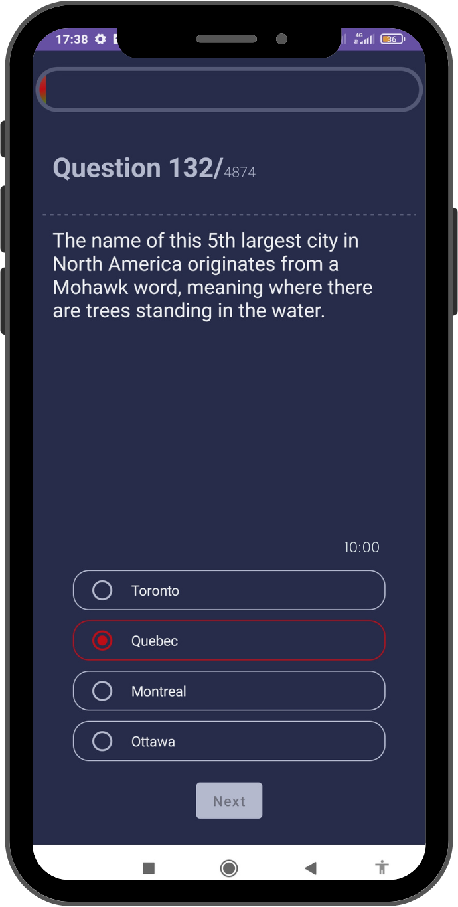
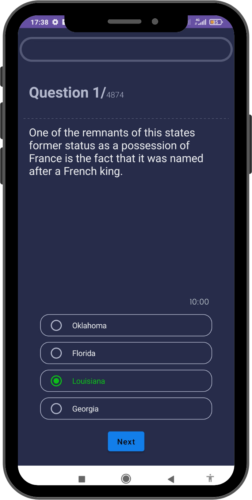

# Jet Trivia App

The Jet Trivia App is a simple Android application that allows users to test their knowledge through a trivia game. This README provides information on how to set up and use the app.
___
<br/>

<br/>
<br/>

<br/>

## Features

- Multiple-choice trivia questions about jets.
- Random selection of questions for each session.
- Keep track of the user's score.
- Display the correct answer after each question.
- Built using Jetpack Compose for a modern UI.

## Prerequisites

Before running the Jet Trivia App, ensure that you have the following:

- Android Studio installed on your machine.
- A compatible Android device or emulator.

## Installation

1. Clone the repository to your local machine:

```
   git clone <repository_url>
```

2. Open Android Studio and select "Open an Existing Project."
3. Navigate to the cloned project directory and select it.

## Usage

1. Build and run the app using the Android Studio emulator or a connected Android device.
2. The app will start and present you with a series of multiple-choice questions about jets.
3. Select the option you believe is the correct answer by tapping on the corresponding choice.
4. After each question, the app will display whether your answer was correct or incorrect, as well as the correct answer.
5. At the end of the game, your total score will be displayed.

## Contributing
Contributions to the Jet Trivia App are welcome. If you find any bugs or have suggestions for improvement, please open an issue or submit a pull request.
